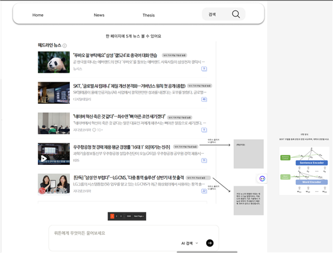
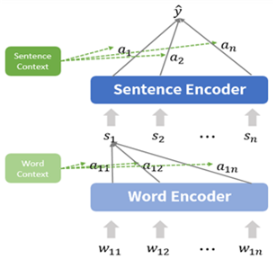
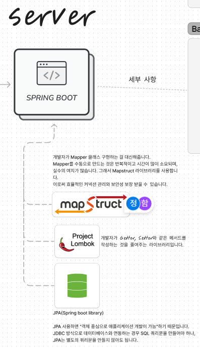
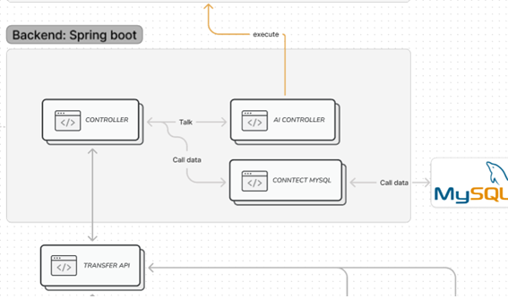
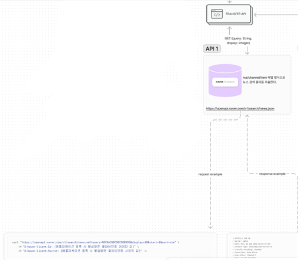
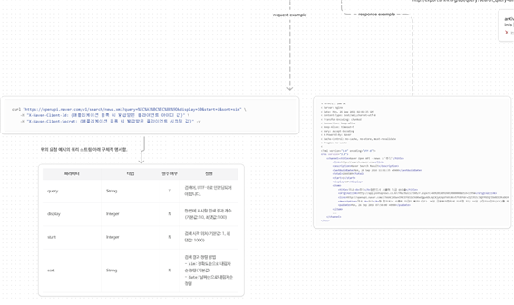
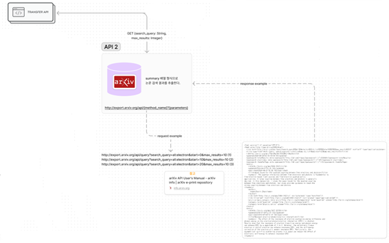
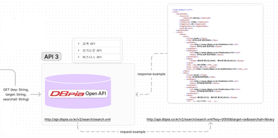
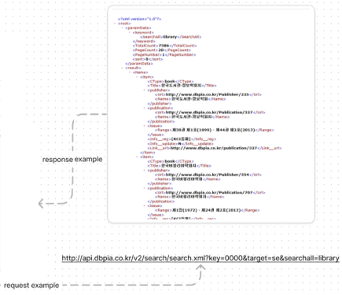
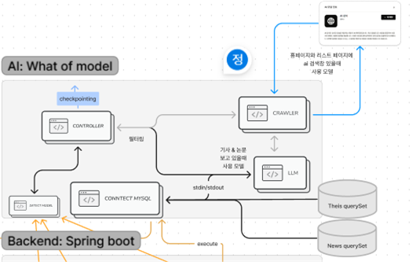

# ViewTechInfoBridge

news and jernal and Thesis....

## 해당 프로젝트 필요 이유

현재 과학기술의 발전이 가파르게 성장하면서 특히 AI와 반도체를 포함해 모든 IT계에서 큰 변동이 일으키고 있다. AI 시대에서 사람이 정보를 판별하고 빠르게 정보를 얻는 것이 중요해지고 있다.
하지만 뉴스 글이나 블로그 등 모든 정보가 여기저기 흩어져 있으며, 이에 습득하는 시간이 많이 소요된다.

과학기술 분야 중 IT 관련 분야에 집중하며, LLM를 이용해 의문점을 해소하고 정보를 습득할 수 있다. 또한 제공하는 LLM은 과학기술 분야에 특화되어 있기에 거짓 뉴스를 예측하고 알려준다. 거짓 뉴스인 이유를 파악하고 판별한다.(뉴스 글을 읽으면서 AI와 대화하는 방식으로 정보를 습득하는데 도움이 많이 된다. 또한 AI는 무분별한 낚시성 뉴스로 정보 취합하는 데 방해가 되지 않도록 정보를 알려준다.)

## 기능(상세 요구 사항)




### [낚시성 기사 판별 ML Model]("https://aihub.or.kr/aihubdata/data/view.do?currMenu=115&topMenu=100&dataSetSn=71338")


[참고](https://www.dbpia.co.kr/journal/articleDetail?nodeId=NODE11485497)

### [LLM Model]("https://huggingface.co/transformers/model_doc/longformer.html")

- LLM (Longformer Language model)
- LLM은 BERT와 같은 모델로, 문장을 이해하고 생성하는 데 사용된다.

## 아키텍처


```
유저는 데스크탑 또는 모바일을 통해 웹 페이지를 접속할 수 있습니다. 이때 이용한 프론트엔드 기술은 React 입니다.
React 라이브러리 Bootstrap, material ui, Axios 사용했습니다.
```



```
유저가 보낸 서비스 요청과 반환을 책임지는 백엔드 기술은 Spring Boot 입니다.
Spring Boot 라이브러리 Mapstruct, Lombok, JPA 사용했습니다.
```

```
Spring Boot의 세부 로직을 간단하게 표현한 것입니다.
사용자가 보낸 정보를 Controller에 의해 적합한 Service 계층에 보내어 데이터를 가공하고 반환합니다.
```

```
Spring Boot가 구현해야 할 핵심의 기능은 스케줄러 1시간마다 API 호출하여 얻은 정보를 가공한 후 AI Controller에 보내어 AI 구동시킵니다. 

그리고 AI 결과값(가짜 뉴스 판별 결과)을 데이터베이스에 업데이트하는 것입니다. 이로써 사용자가 원하는 정보를 얻을 수 있도록 아키텍처를 설계했습니다.
```










## apply github commit message

```shell
git config commit.template .gitmessage.txt
```

해당 프로젝트에만 커밋 템플릿을 적용할 수 있음.
